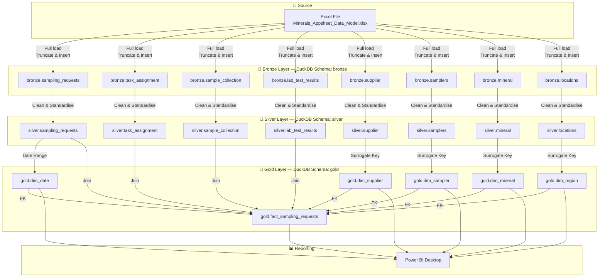

# Data Flow Diagram
## Minerals ETL Pipeline

---



---

## Pipeline Execution Order

```
1. pipeline_bronze.py
      ├── load_bronze_sampling_requests.py
      ├── load_bronze_task_assignment.py
      ├── load_bronze_sample_collection.py
      ├── load_bronze_lab_test_results.py
      ├── load_bronze_supplier.py
      ├── load_bronze_samplers.py
      ├── load_bronze_mineral.py
      └── load_bronze_locations.py

2. pipeline_silver.py
      ├── load_silver_sampling_requests.py
      ├── load_silver_task_assignment.py
      ├── load_silver_sample_collection.py
      ├── load_silver_lab_test_results.py
      ├── load_silver_supplier.py
      ├── load_silver_samplers.py
      ├── load_silver_mineral.py
      └── load_silver_locations.py

3. pipeline_gold.py
      ├── load_gold_dim_supplier.py
      ├── load_gold_dim_sampler.py
      ├── load_gold_dim_mineral.py
      ├── load_gold_dim_region.py
      ├── load_gold_dim_date.py
      └── load_gold_fact_sampling_requests.py
```